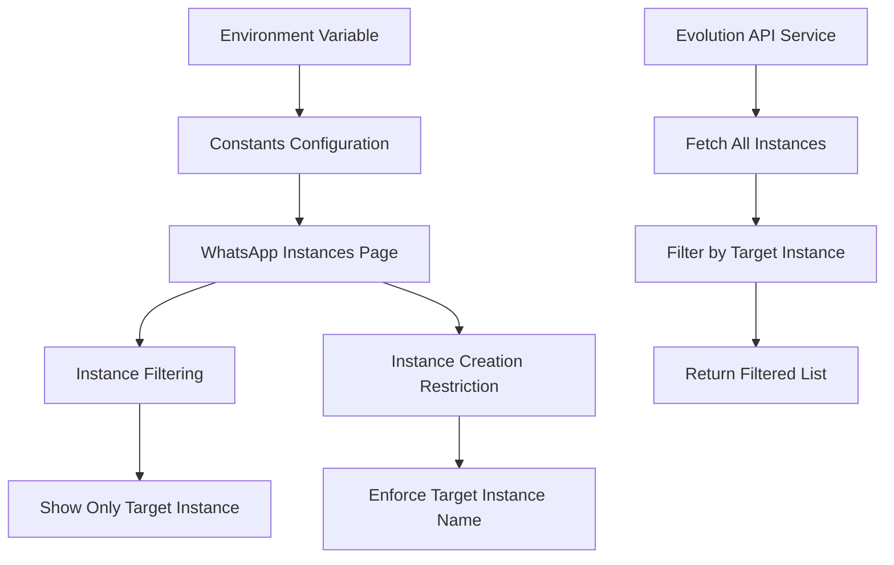

# WhatsApp Target Instance Configuration

This feature allows you to configure the application to only show and connect to a specific WhatsApp instance, improving security and simplifying the user interface for single-instance deployments.

## Configuration

### Environment Variable

Add the following environment variable to your `.env` or `.env.local` file:

```env
VITE_WHATSAPP_TARGET_INSTANCE=istn
```

Replace `istn` with the name of your target WhatsApp instance.

### Default Value

If not configured, the default target instance is set to `"istn"`.

## Features

### 1. Instance Filtering
- **WhatsApp Instances Page**: Only displays instances matching the target instance name
- **Evolution API Integration**: Filters Evolution API instances to show only the target instance
- **Database Filtering**: Filters database-stored instances by name or instance key

### 2. Instance Creation Restrictions
- **Pre-filled Name**: The instance creation modal pre-fills with the target instance name
- **Read-only Field**: The instance name field is read-only to prevent creating other instances
- **Validation**: Validates that created instances match the target instance name
- **Default Type**: Defaults to Evolution API connection type

### 3. UI Indicators
- **Target Instance Badge**: Shows the current target instance in the header
- **Environment Lock Notice**: Indicates that the instance name is environment-locked

## Implementation Details

### Modified Files

1. **`src/constants/index.ts`**
   - Added `TARGET_INSTANCE` to `WHATSAPP_CONFIG`
   - Reads from `VITE_WHATSAPP_TARGET_INSTANCE` environment variable

2. **`src/pages/WhatsAppInstances.tsx`**
   - Added filtering logic in `allInstances` computation
   - Enhanced UI to show target instance indicator
   - Modified instance creation to enforce target instance name
   - Updated modal to pre-fill and lock instance name

3. **`src/services/evolutionApiService.ts`**
   - Modified `fetchInstances()` to filter Evolution API instances
   - Only returns instances matching the target instance name

4. **`ENVIRONMENT_VARIABLES.md`**
   - Added documentation for the new environment variable

### Code Flow



## Benefits

1. **Security**: Prevents access to unintended WhatsApp instances
2. **Simplicity**: Reduces UI complexity for single-instance deployments
3. **Environment Isolation**: Different environments can target different instances
4. **Error Prevention**: Prevents accidental creation of incorrect instances

## Example Configuration

For the ISTN environment:

```env
# .env.local
VITE_WHATSAPP_TARGET_INSTANCE=istn
VITE_EVOLUTION_API_URL=https://evo.istn.ac.id
VITE_EVOLUTION_API_KEY=your-api-key-here
```

This configuration ensures that only the "istn" WhatsApp instance is visible and manageable through the application interface.

## Migration Notes

- Existing instances with different names will be hidden from the UI
- Database instances are filtered by both `name` and `instanceKey` fields
- No data is deleted; instances are simply filtered from the display
- To change the target instance, update the environment variable and restart the application 